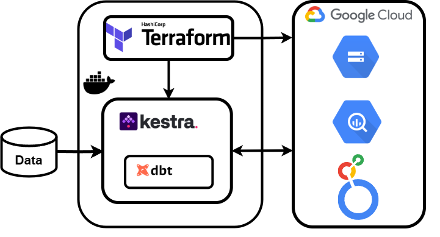

# USA Birth Rate Data Engineering Project

### Table of Contents
- [Overview](#overview)
- [Key Features](#key-features)
- [Problem & Solution](#problem--solution)
- [Deployment Architecture](#deployment-architecture)
- [Deployment Guide](#deployment-guide)
- [Dashboard Visualization](#dashboard-visualization)
- [Summary](#summary)


## Overview
This project is part of a data engineering course and focuses on processing the [USA Birth Rate (2016-2018)](https://console.cloud.google.com/marketplace/product/center-disease-control/wonder-births) dataset from BigQuery. This dataset contains natality data based on CDC-collected statistics for live births occurring within the United States to U.S. residents. It provides comprehensive demographic, health, and medical information about mothers, fathers, and infants, offering valuable insights into birth trends and social determinants of health. The project demonstrates an end-to-end data pipeline using modern cloud technologies.

## Key Features
- **Cloud-based Infrastructure**: Uses Google Cloud Platform (GCP) with Infrastructure as Code (Terraform).
- **End-to-End Pipeline**: Data ingestion, transformation, and visualization automated via DAG workflows.
- **Optimized Storage**: Data is partitioned for efficient querying.
- **Transformation with dbt**: Data cleaning and structuring using dbt.
- **Visualization with Looker Studio**: Interactive dashboards for insights.

## Problem & Solution
### Challenges:
- Fragmented natality data across multiple tables.
- Large-scale dataset requiring efficient storage and processing.
- Complex ETL workflows.
- Need for accessible insights for public health research.

### Solution:
A scalable cloud-based pipeline that automates data ingestion, transformation, and visualization:
1. **Ingestion & Storage**: Extracts data from BigQuery, converts it to CSV, and stores it in Google Cloud Storage.
2. **Transformation**: Uses dbt to clean and structure data, ensuring consistency across tables.
3. **Workflow Orchestration**: Kestra automates pipeline execution via DAGs.
4. **Querying & Optimization**: Transformed data is loaded into partitioned BigQuery tables for efficient analysis.
5. **Visualization**: Dashboards in Looker Studio provide insights into birth trends and demographics.

## Deployment Architecture
The whole architecture is shown in the picture below:


- **Kestra**: Orchestrates the data pipeline.
- **Terraform**: Automates infrastructure provisioning.
- **PostgreSQL**: Stores Kestra’s metadata.
- **GCP (BigQuery, Cloud Storage)**: Stores and processes data.
- **dbt**: Handles data transformation.
- **Docker**: Manages containerized services for reproducibility.
- **Looker Studio**: Visualizes processed data in interactive dashboards.

## Deployment Guide
### Prerequisites:
- Google Cloud Platform account with a project and credentials for this project (with BigQuery Admin and Storage Admin permissions).
- Git
- Docker

### Steps:
1. **Clone the repository**:
   ```bash
   git clone https://github.com/IuliiaKameneva/DataEngineering_Project_USA_Births.git
   cd DataEngineering_Project_USA_Births/
   ```
2. **Prepare credentials**:
   ```bash
   mkdir essential_data
   ```
   Place your Google Cloud service account JSON file in the `essential_data` directory.
3. **Set up environment**:
   ```bash
   bash env_script.sh essential_data/<YOUR_CREDENTIALS_FILE>.json
   ```
4. **Update Project Configuration**:
   - Edit `variables.tf` and specify your GCP project ID in the `project` variable.
5. **Deploy the infrastructure**:
   ```bash
   docker-compose up --build
   ```
   - This provisions cloud resources and configures Kestra workflows.
6. **Verify Successful Deployment**: 
   - Wait for the Terraform completion message:
   ```bash
   terraform-1  | Apply complete! Resources: 6 added, 0 changed, 0 destroyed.
   ```
7. **Initial Flow Execution**:
   - Access the Kestra UI at: [http://localhost:8080/ui/flows/edit/final_project/bigquery_extraction_flow](http://localhost:8080/ui/flows/edit/final_project/bigquery_extraction_flow)
   - Click "Execute"
   - Select "Debug" for the `dbt_command` parameter
   - Click "Execute" again
   
   This will:
   - Download the dbt project files from GitHub
   - Validate the database connection
   - Prepare the environment for data transformation

8. **Main Pipeline Execution**:
   - Execute the flow again without modifying parameters (default `dbt build` command)
   - This performs the complete ETL pipeline:
     1. Extracts tables from BigQuery public datasets
     2. Converts data to CSV format
     3. Uploads to Google Cloud Storage
     4. Creates external BigQuery tables
     5. Executes dbt transformations

### Partitioning & Clustering
BigQuery tables are optimized using:
```sql
{{
  config(
    materialized='table',
    partition_by={
      "field": "year_date",
      "data_type": "date",
      "granularity": "year"
    }
  )
}}
```
This improves query performance by reducing the amount of scanned data.

## Dashboard Visualization
The processed data is visualized in an interactive [Looker Studio report](https://lookerstudio.google.com/reporting/b6746fc0-fd70-4e38-88fa-a4ba20d15288), showcasing birth trends across demographics.

## Summary
This project meets key data engineering criteria:
- **Cloud-based solution** with Infrastructure as Code.
- **Automated ETL pipeline** with multiple DAG steps.
- **Optimized storage** with partitioned and clustered tables.
- **dbt transformations** for structured data processing.
- **Interactive dashboard** with clear insights.
- **Easy deployment** with clear setup instructions.

The result is a scalable, efficient, and automated data pipeline that makes natality data accessible and actionable for public health research.

