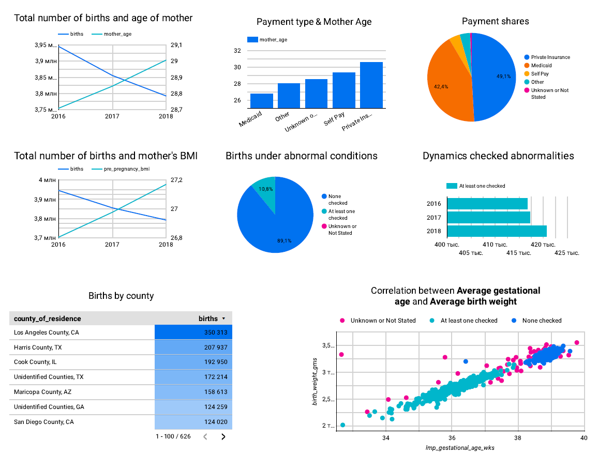
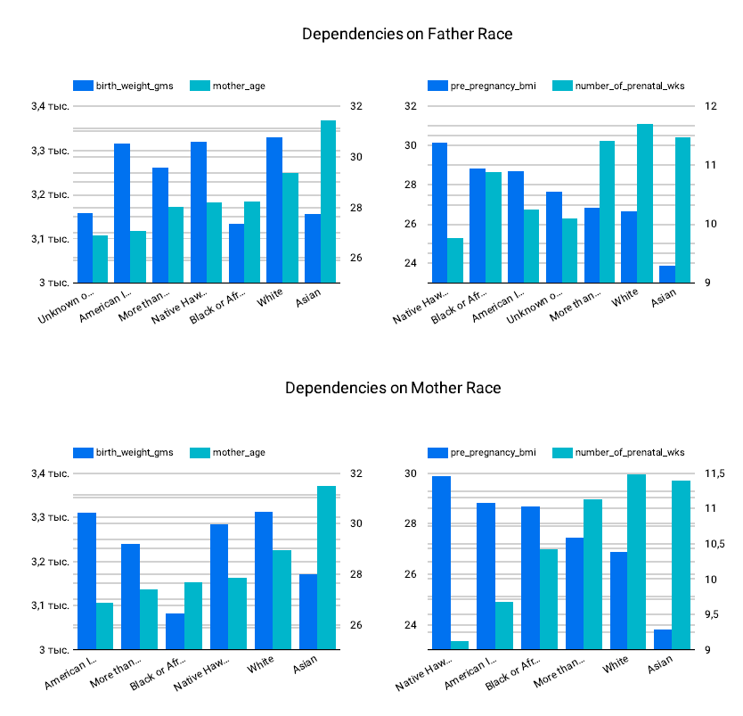

# USA Birth Rate Data Engineering Project

### Table of Contents
- [Overview](#overview)
- [Technical Requirements](#technical-requirements)
- [Deployment Architecture](#deployment-architecture)
- [Deployment Guide](#deployment-guide)
- [Dashboard Visualization](#dashboard-visualization)

## Overview

For the final project in the data engineering course, I am using the [<b>USA Birth Rate (2016-2018)</b>](https://console.cloud.google.com/marketplace/product/center-disease-control/wonder-births?hl=ru&inv=1&invt=Abs1rg) dataset. It's a one of [Datasets from BigQuery](https://cloud.google.com/bigquery/public-data/) Here's a brief overview of its features and what I am doing with it:

### Dataset Features

This dataset contains natality data based on CDC-collected statistics for live births occurring within the United States to U.S. residents. It provides comprehensive demographic, health, and medical information about mothers, fathers, and infants, offering valuable insights into birth trends and social determinants of health.  

#### **Dataset Scope**  
The dataset captures a wide range of maternal characteristics, including:  
- **Demographic Data:** State and county of residence, mother's age, race, ethnicity, country of origin, marital status, and education level.  
- **Health & Medical Data:** Previous birth history, number of prenatal care visits, payment method, congenital anomalies, and other morbidity data.  

Additionally, it includes:  
- **Paternal Information:** Age, race, ethnicity (including country of origin), and education.  
- **Infant Characteristics:** Gender, birth weight, congenital abnormalities, and delivery details.  

#### **Use Cases**  
This dataset is valuable for researchers and public health professionals aiming to:  
- Identify regions with higher rates of complicated or high-cost births.  
- Analyze demographic factors contributing to maternal and infant health outcomes.  
- Develop targeted intervention strategies based on population characteristics.  

The data is derived from birth certificates reported to the CDC, ensuring accuracy and consistency across records.  

#### **Dataset Tables**  
The dataset consists of multiple tables, each providing specialized insights into different aspects of natality:  

1. **county_natality** – Core natality statistics at the county level.  
2. **county_natality_by_abnormal_conditions** – Data on abnormal birth conditions.  
3. **county_natality_by_congenital_abnormalities** – Statistics on congenital birth defects.  
4. **county_natality_by_payment** – Distribution of payment methods for birth-related medical expenses.  
5. **county_natality_by_father_race** – Birth statistics categorized by paternal race.  
6. **county_natality_by_maternal_morbidity** – Data on maternal morbidity and health complications.  
7. **county_natality_by_mother_race** – Birth statistics categorized by maternal race.  


### What I Am Doing with It
- Data Ingestion: I am ingesting the dataset into a cloud storage solution (e.g., Google Cloud Storage) using Terraform for infrastructure automation.
- Data Transformation: Using dbt (Data Build Tool), I am cleaning and transforming the data to create structured tables for analysis.
- Orchestration: I am using Kestra to orchestrate the entire pipeline, ensuring that data ingestion, transformation, and loading happen in a coordinated manner.
- Visualization: Finally, I am creating interactive dashboards (e.g., using Looker Studio) to visualize trends in birth rates across different states and demographic groups.

This project demonstrates end-to-end data engineering skills, from infrastructure setup to data transformation and visualization. 

## Technical Requirements

- Git
- Google Cloud Platform Account
    - Empty project and credentials for this project with BigQuery Admin and Storage Admin permissions
- Docker

## Deployment Architecture

The whole architecture is shown in the picture below:


This project implements a data pipeline that extracts natality data from BigQuery public datasets, processes it, and loads it into a custom BigQuery dataset. The solution leverages several modern technologies:

- **Kestra**: An open-source orchestration and scheduling platform that manages the data workflow
- **Terraform**: Infrastructure as Code tool for provisioning GCP resources and configuring Kestra
- **PostgreSQL**: Database backend for Kestra's metadata storage
- **Google Cloud Platform (GCP)**: Hosts the data storage (BigQuery, Cloud Storage) and processing infrastructure
- **dbt (data build tool)**: For data transformation and modeling

The pipeline specifically works with the CDC Wonder Natality public dataset, extracting several related tables, converting them to CSV format, storing them in Cloud Storage, and creating external tables in BigQuery.

### Detailed Architecture

#### 1. Infrastructure Components

##### Docker Services (docker-compose.yml)
The project runs three main services in Docker containers:

1. **PostgreSQL**:
   - Stores Kestra's metadata (executions, flows, etc.)
   - Configured with database `kestra`
   - Data persisted in a Docker volume (`postgres-data`)

2. **Kestra**:
   - The orchestration engine (latest version)
   - Configured to use PostgreSQL for repository and queue storage
   - Exposes ports 8080 (UI/API) and 8081 (health checks)
   - Mounts Docker socket for task execution
   - Disables basic authentication for development

3. **Terraform**:
   - HashiCorp's official Terraform image
   - Mounts the current directory and GCP credentials
   - Automatically runs `init`, `plan`, and `apply`

##### Networking
- All services communicate over a custom bridge network `kestra-network`

#### 2. Terraform Configuration (main.tf)

The Terraform configuration performs several key functions:

##### Providers
- **Google**: For GCP resource management
- **Kestra**: To interact with the Kestra API
- **HTTP**: For data fetching

##### GCP Resources
1. **Cloud Storage Bucket**:
   - Creates a bucket (if it doesn't exist) with:
     - Lifecycle rule to delete objects after 3 days
     - Force destroy enabled
     - Location set to US

2. **BigQuery Dataset**:
   - Creates a dataset (if it doesn't exist) with:
     - US location
     - Prevent destroy disabled

##### Kestra Resources
1. **Key-Value Stores**:
   - Stores GCP configuration as Kestra key-value pairs:
     - `GCP_PROJECT_ID`: Project ID
     - `GCP_LOCATION`: Dataset/bucket location
     - `GCP_BUCKET_NAME`: Storage bucket name
     - `GCP_DATASET`: BigQuery dataset name
     - `GCP_CREDS`: Base64-encoded service account credentials

2. **Flow Deployment**:
   - Deploys the main data pipeline flow from `gcp_natality_flow.yaml`

#### 3. Data Pipeline (gcp_natality_flow.yaml)

The Kestra flow performs the following operations:

##### Inputs
- `tables`: List of BigQuery tables to process (default: 7 natality-related tables)
- `dbt_command`: Selector for dbt operation (default: `dbt build`)

##### Main Workflow
1. **Conditional Execution**:
   - If `dbt_command` is `build`:
     - For each table:
       1. Extracts data from BigQuery public dataset
       2. Converts to CSV format
       3. Uploads to GCS
       4. Creates external table in BigQuery
   - Else (for `dbt debug`):
     - Syncs dbt project files from GitHub

2. **dbt Operations**:
   - Runs `dbt deps` and the selected command
   - Uses a custom dbt-bigquery Docker image
   - Configures connection to BigQuery using the service account
   - Stores manifest for potential later use

##### Triggers
- Scheduled to run dayly (`0 0 * * *`)
- Includes backfill capability starting from October 2023

##### Plugin Defaults
- Pre-configures GCP plugin settings using the KV store values

## Deployment Guide

### Initial Setup

1. **Clone the Repository**:
   ```bash
   git clone https://github.com/IuliiaKameneva/DataEngineering_Project_USA_Births.git
   cd DataEngineering_Project_USA_Births/
   ```

2. **Prepare Credentials**:
   ```bash
   mkdir essential_data
   ```
   Place your Google Cloud service account credentials JSON file in the `essential_data` directory.

3. **Configure Environment**:
   ```bash
   bash env_script.sh essential_data/<YOUR_CREDENTIALS_FILE>.json
   ```

4. **Update Project Configuration**:
   Edit `variables.tf` and specify your GCP project ID in the `project` variable.

### Deployment Execution

1. **Launch the Infrastructure**:
   ```bash
   docker-compose up --build
   ```
   This command will:
   - Initialize all Docker containers
   - Run Terraform to provision cloud resources (storage buckets, BigQuery datasets)
   - Configure Kestra with the necessary workflows

2. **Verify Successful Deployment**:
   Wait for the Terraform completion message:
   ```
   terraform-1  | Apply complete! Resources: 8 added, 0 changed, 0 destroyed.
   ```

### Initial Flow Execution

1. **First Run (Debug Mode)**:
   - Access the Kestra UI at: [http://localhost:8080/ui/flows/edit/final_project/bigquery_extraction_flow](http://localhost:8080/ui/flows/edit/final_project/bigquery_extraction_flow)
   - Click "Execute"
   - Select "Debug" for the `dbt_command` parameter
   - Click "Execute" again
   
   This will:
   - Download the dbt project files from GitHub
   - Validate the database connection
   - Prepare the environment for data transformation

2. **Main Pipeline Execution**:
   - Execute the flow again without modifying parameters (default `dbt build` command)
   - This performs the complete ETL pipeline:
     1. Extracts tables from BigQuery public datasets
     2. Converts data to CSV format
     3. Uploads to Google Cloud Storage
     4. Creates external BigQuery tables
     5. Executes dbt transformations

### Scheduling and Maintenance

- The workflow is automatically scheduled to run dayly
- Manual execution is only required for the initial setup

### Shutdown Procedure

To stop the environment:
```bash
docker compose down -v
```

**Note**: The `-v` flag will remove all Docker volumes, including the PostgreSQL database. Omit this flag if you want to preserve execution history between deployments.


## Dashboard Visualization
After successfull flow execution you can visualize the data like in the report [https://lookerstudio.google.com/reporting/b6746fc0-fd70-4e38-88fa-a4ba20d15288](https://lookerstudio.google.com/reporting/b6746fc0-fd70-4e38-88fa-a4ba20d15288)

It can looks like



This report uses the pivot tables are generated with dbt and updates automatically.
